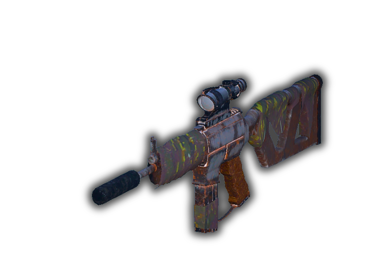
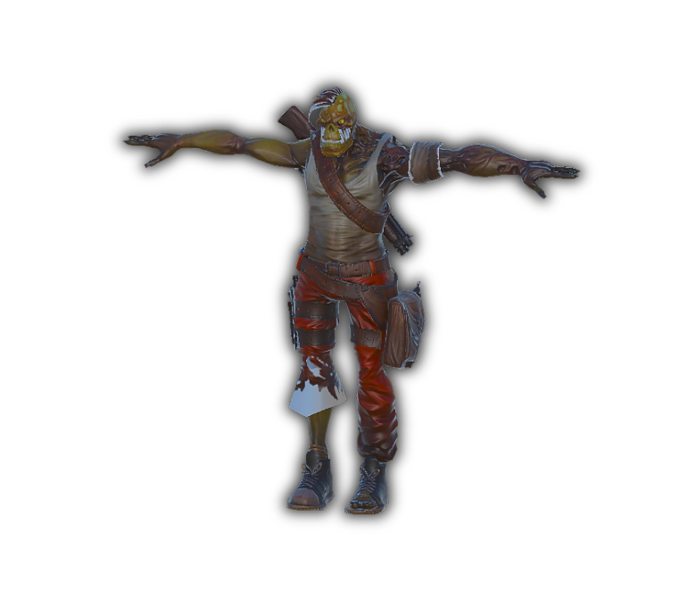
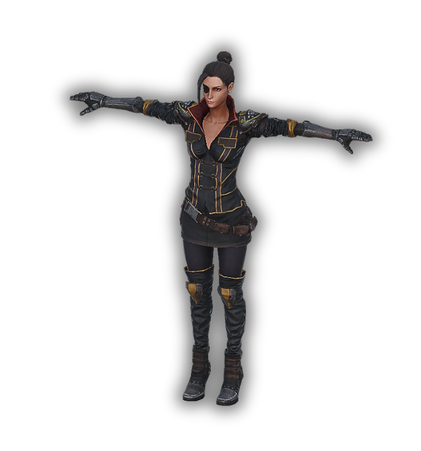
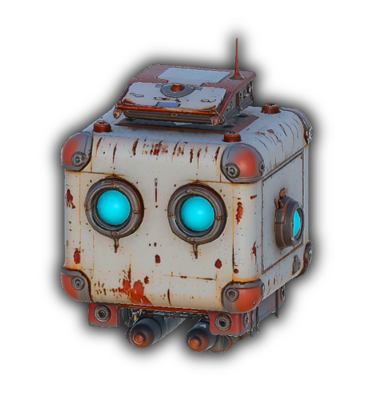

# 🎮 Project Overview

This project is a **top-down shooter** game that blends **action-packed gameplay** with **rogue-like elements**. Set in a post-apocalyptic world, players take on the role of a survivor who must venture out from a secure base to **locate and rescue scattered companions**.

## 🧠 Core Concept

The game begins at a safe base area. The player's mission is to explore dangerous zones, fight off enemies, and **rescue lost allies**. Along this journey, you're accompanied by an **AI-powered intelligent robot companion** that can switch between multiple functional modes, such as combat, support, and scouting, depending on the situation.

---

## ⚙️ Technical Features

- Developed with **Unity Engine (C#)**
- Uses **Scriptable Objects** for data management (e.g., level data, character stats, robot modes)
- **Component-based architecture** for modular and extensible design
- Game interactions handled via **event-driven system** (Action/Delegate based)
- **Procedurally generated levels** (planned/in development)
- **AI Companion System**:
  - Multiple modes (attack, defense, scout, etc.)
  - Dynamic mode switching based on in-game context
  - Behavior changes depending on player distance, enemy density, and other environmental factors
- **Companion Rescue System**:
  - Each rescued ally unlocks new active abilities or gameplay advantages
  - Companions contribute both narratively and mechanically

---

## 🕹️ Gameplay Mechanics

- **Top-Down Controls**: Character movement via twin-stick (WASD + Mouse)
- **Rogue-like Elements**: Each run provides unique challenges and randomness
- **Resource Management**: Collect materials (e.g., scrap) for upgrades and progression
- **Companion Robot**: AI robot supports the player in combat and navigation with modular behavior
- **Upgrade System**: Both the player and companion can be upgraded using resources
- **Interactive Objects**: Players can interact with environmental elements to complete objectives or gain advantages

---

## 🗺️ Development Status

> The project is currently in early development. Core gameplay systems (character movement, robot companion behavior, basic combat) are prototyped or functional.

---

# Project - DevLog 📝

⚠️Because I started the devlog late, I will write what I have done so far superficially. The rest will be more detailed.
### Current Features 📈

- The player; 
   - Has 8 dimension animations
   - Has health system
   - Has health bar
   - Has 3D Crosshair
   - Has red line gun barrel to crosshair
   - Can aims to crosshair without any animation corruption
   - Can smoothly aim toward the position of the crosshair.
   - Can kill the enemies
   - Can collect scrap dropped by enemies.
   - Can get damage by enemies

## Core Assets - 🎨

  
  
  
  

## Player Actions - 🔄

  
  
  
  
  

## Companion Modes - 🟢🔵🔴

  

